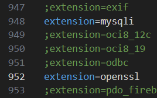

# CS-338
MySQL database handling with PHP

## Requirements
Since MySQL is run on the local machine, all members must complete the installation. Everything in this section should only be done once.
### Installation
#### MySQL
1. Navigate to MySQL downloads: https://dev.mysql.com/downloads/mysql/
2. For the following instructions, 8.0.37 is used (any version >=8.0 works fine, but may have slightly different installation processes). Select the version and your operating system. For Windows, go to https://dev.mysql.com/downloads/windows/installer/8.0.html and download either one of the 8.0 MSI installers. Download and run the installer. Click "No thanks, just start my download" if prompted. 
3. Make note of the download location, it's useful later. This is typically in `C:/Program Files/MySQL`. Change if desired. 
4. Continue until "Choosing a Setup Type". Select "Full".
5. "Next"/"Execute" when prompted. No need to change configurations until "Accounts and Roles" page. If some download/installation fails, click "Back" and "Execute" again.
6. On "Accounts and Roles" page, set up a password for your root account. Remember this password.
7. "Next"/"Execute"/"Finish" when prompted. Upon "Connect To Server", enter the password for the root account you set up earlier.
8. "Next"/"Execute"/"Finish" when prompted. Upon "Installation Complete", click "Finish".

#### PHP
1. Navigate to PHP downloads: https://www.php.net/downloads.php and download the appropriate file. For Windows, click on "Windows downloads" and download the Thread Safe zip file (don't download the source code). Download and extract the files. Make note of where it is extracted.
2. Navigate to the root folder of your PHP files. Look for `php.ini`. If instead you only find `php.ini-development` and/or `php.ini-production`, make a copy of `php.ini-development`, place it in the same folder, then rename it to `php.ini`. 
3. Open `php.ini`. Enable the `mysqli` extension by looking for `extension=mysqli` and uncomment the line from the list of extensions (delete the leading semicolon), as shown below. 

    

4. Do the same with the `openssl` extension. This should be located not far below the `mysql` extension, as shown above. 
5. In the same file, specify the extensions directory by looking for `extension_dir`. Uncomment one of the following lines according to your system. Typically, on Linux/Unix systems including Mac, uncomment `extension_dir = "./"`, on Windows systems, uncomment `extension_dir = "ext"`. Leave the other one commented.

    

6. Save the `php.ini` file. You would likely need admin priveleges.

### Path Configuration
Sometimes, the Path configuration to the MySQL and/or PHP installation is not set automatically. Edit the "Path" variable so it contains a path to both the `/bin/` folder under the installed `MySQL/MySQL Server 8.0` folder, as well as the main `PHP` folder that you extracted. Make sure to leave existing Path variables untouched.
* On Windows: https://www.architectryan.com/2018/03/17/add-to-the-path-on-windows-10/
* On Mac: https://pimylifeup.com/macos-path-environment-variable/
* On Linux: https://www.linuxjournal.com/content/how-set-or-modify-path-variable-linux

For example, these are my newly added Path values. 

### Configuration
#### MySQL
1. Configure the MySQL user. Open your terminal, type `mysql -u root -p`. When prompted, enter the root password that you set earlier. 
2. Type the following two commands sequentially in the terminal. Please use only the EXACT username and password provided ('user1' and 'password'):

    `CREATE USER 'user1'@'localhost' IDENTIFIED BY 'password';`

    `GRANT ALL PRIVILEGES ON *.* TO 'user1'@'localhost';`

## Start Server
Great. Now you want to start the PHP/MySQL server. On your local machine, the started server will be located at `http://127.0.0.1:8000/`. Do this whenever you want to see your new changes at work.
1. Start the PHP server in this root directory using the command `php -S 127.0.0.1:8000`
2. Navigate to `http://127.0.0.1:8000/exampleDB.php`. This is the local homepage.

## Current Features
* 
